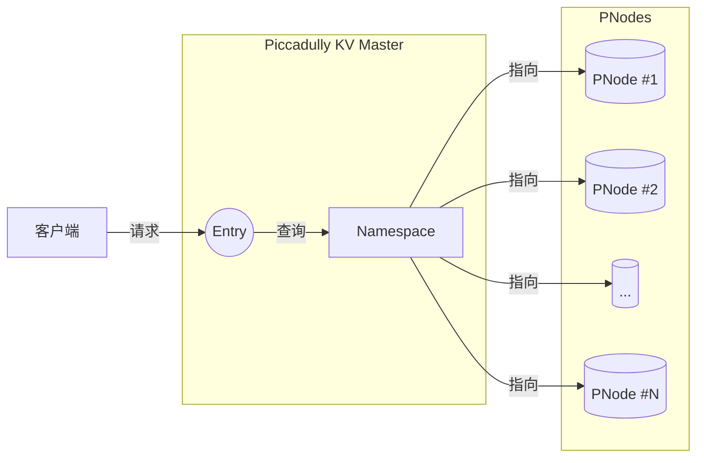
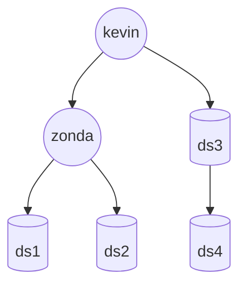
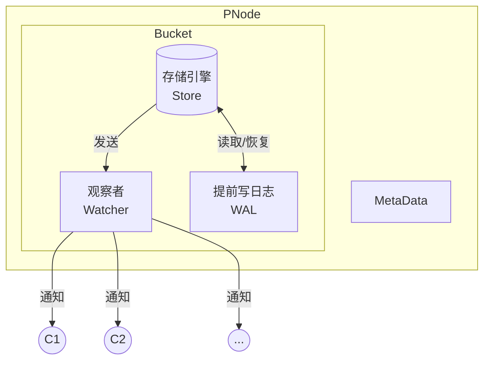

<p align="center"></img></p>
<h1 align="center">Piccadilly KV 架构</h1>

[TOC]

> **术语**  
> **Master/DB**：负责路由请求到对应的 PNode 节点。其也负责管理 Namespace 和 PNode 调度。  
> **Namespace**：类似于文件系统的路径，用于寻址 PNode 节点。  
> **PNode 节点**：PKV 的基础存储单元，负责存储数据。

## 总体架构



PKV 使用分层架构，客户端通过 Master 节点访问数据，Master 节点负责路由请求到对应的 PNode 节点。路由通过请求中的 `namespace` 字段获取 PNode 对应的路径。并通过 `Namespace` 存储结构寻找路径对应的 PNode 节点。

## Namespace (NS) / 命名空间

PKV 使用路径表示一个类似于文件系统的树状结构。如考虑如下文件路径：

```
/kevin/zonda/ds1
/kevin/zonda/ds2
/kevin/ds3
/kevin/ds3/ds4
```
其理想的树状结构类似于



PKV 将任意地址假设为一个 PNode，即便这个路径可能不存在 PNode。

但是实现中 Namespace 并不以树状结构储存，因为其对并发访问的支持不够好。且如果路径很长，树状结构的深度可能会很大，导致访问效率低下。实现中 Namespace 以一个哈希表储存，哈希表的键为路径，值为 PNode 的地址，其寻址效率为 $O(1)$ 而不是 $O(\log n)$。

上述数据结构在内存可以被表示为

```
NS Key           -> NS Value
/kevin/zonda/ds1 -> PNode #1
/kevin/zonda/ds2 -> PNode #2
/kevin/ds3       -> PNode #3
/kevin/ds3/ds4   -> PNode #4
```


## PNode

PNode 是 PKV 的基本单元，其组织layout如下：



Bucket（也称为 Tablet）是 PNode 的基本存储单元，其包含一个 Store （存储引擎） 和一个 WAL。Store 用于存储数据，WAL 用于记录数据的变更（Write-ahead Log）。Watcher 用于监控 Bucket 的变更，当 Bucket 发生变更时，Watcher 会通知所有关注者节点。

每个 Bucket 拥有自己的写入锁，用于保证写入的原子性。Bucket 的写入锁是一个读写锁，用于保证写入的原子性。当一个 Bucket 正在写入时，其他写入请求会被阻塞，直到写入完成。

需要注意的是 Bucket 支持多种并发模型 `Linear` 和 `NoLinear`，这里面的区别为 `Linear` 会保证写入的顺序，而 `NoLinear` 不会保证写入的顺序且需要存储引擎支持并发安全。

PKV 内置 `MemTable` 和 `SwissTable` 作为存储引擎，其都支持并发写入。默认情况下，存储引擎会使用 SwissTable。默认的存储引擎的数据结构类似于 `map[string]string` 或者说类似于 Java 中的 `HashMap<String, String>`。

客户端可以选择监听（Watch）Bucket中的数据变更。当 Bucket 中的数据发生变更时，Watcher 会通知所有关注的客户端。

WAL 保证了数据的持久性。每次写操作，PNode 会先将日志写入 WAL 再进行更新内存。即便在 PNode 挂掉的情况下，数据也不会丢失。当 PNode 被重新拉起（Pull up）时，其会自动从 WAL 中恢复数据。

