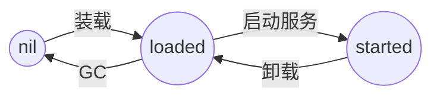

<p align="center"></img></p>
<h1 align="center">Piccadilly KV Namespace</h1>

Namespace 是 PKV 用于路径转换的系统。其由锁支持的并发字典实现。其的键为路径，值为 PNode 的地址。

```
--Query--> Namespace                        PNode Cluster
           +-----------------+-------+
           | Key             | Value |
           +-----------------+-------+
           | kevin/zonda/ds2 |   o---+----> PNode #1
           | kevin/zonda/ds1 |   o---+----> PNode #2
           | path            |   o---+----> PNode #3
           +-----------------+-------+
```

## PNode as a Management Unit

PNode 本质上是 Bucket 的管理单元（BMU/SMU，Bucket/Store Management Unit）。
PNode 的核心构成为：

```go
type PNode struct {
    Bkt      *Tablet.Bucket
    LoadTime int64
    Started  bool
	// other meta data
}
```

PNode 的状态机：



- nil 状态：未被初始化或未被分配给 NS  
  被标记为 PNode 为空或未存在于 NS
- loaded 状态：已被分配给 NS，但是 Bucket 未被启动。  
  被标记为 LoadTime 为 0
- started 状态：已启动服务  
  被标记为 Started 为 true

## 通过 NS 调度 PNode

调度器会通过 NS 确定 PNode 是否存在于 NS。如果不存在则该 PNode 状态为 nil。我们并不知道这是否是一个有效 PNode。我们可以尝试从磁盘装载（load）这个 PNode。

如果该 PNode 存在于内存，则可以确定 PNode 的状态：loaded 或者 started。如果是 loaded 的状态，我们可以根据需要选择是否拉起（Pull up）这个 PNode。

如果是 started 的状态，我们可以根据需要选择是否卸载（unload）这个 PNode。

## PNode 发现

PKV 默认不保存 PNode 的所有位置，且 PNode 是惰性装载的。那我们该怎么发现 PNode 的位置？

PKV 做的假设为：NS 的 Key 是一个有效的 Unix 路径，例如 `kevin/zonda`。PKV 会根据该路径进行搜索。目前的发现策略为当这个目录存在，则默认该目录为一个 PNode。

为对抗可能的攻击，例如 Path Injection，我们会对 NS Key 进行过滤，也被称为 Sanitize（清洁）。过滤规则为将所有无效字符替换为 `_`。

